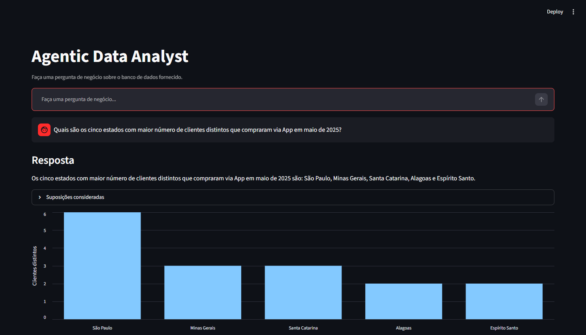
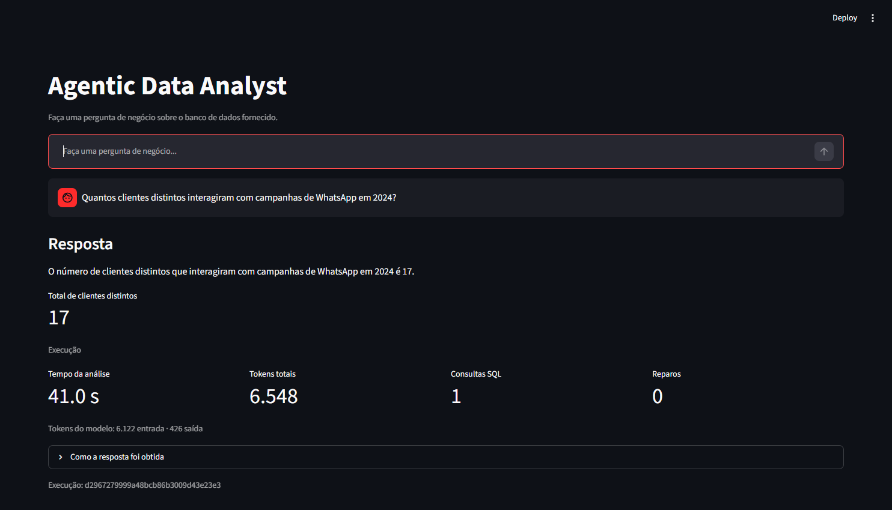
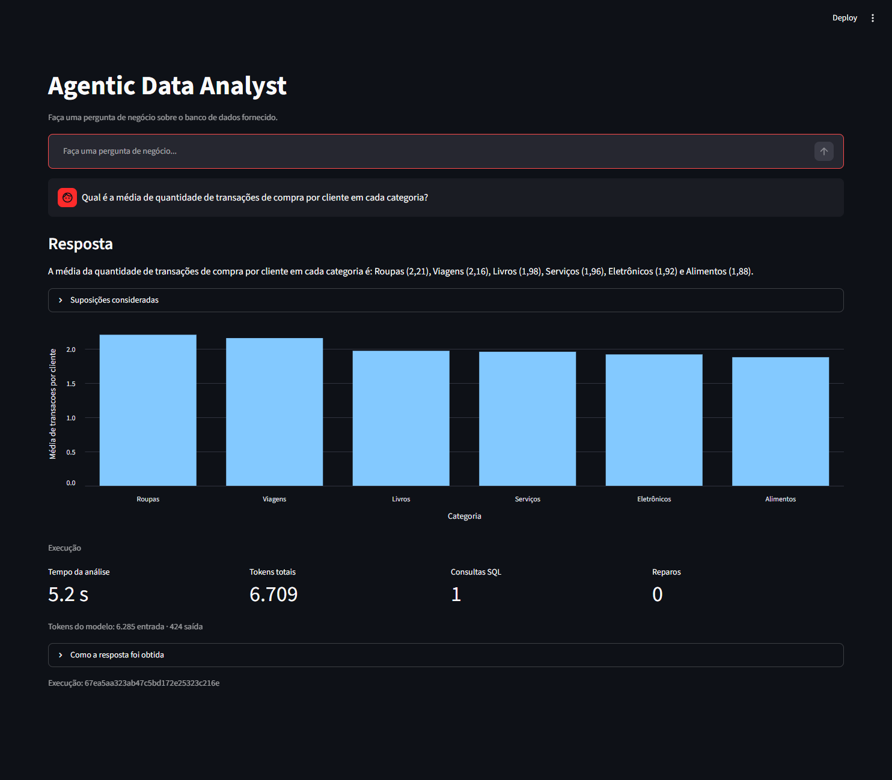
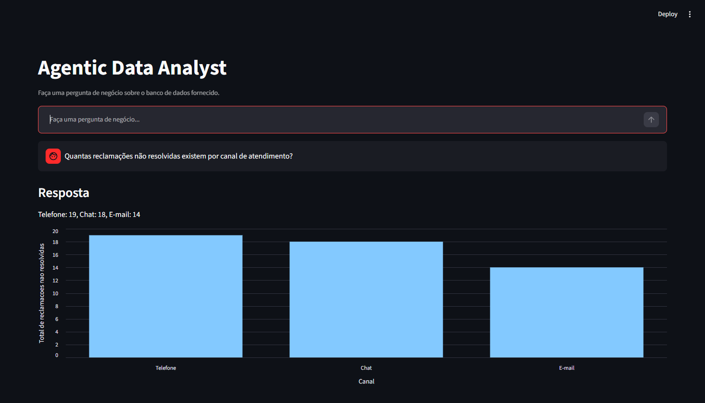
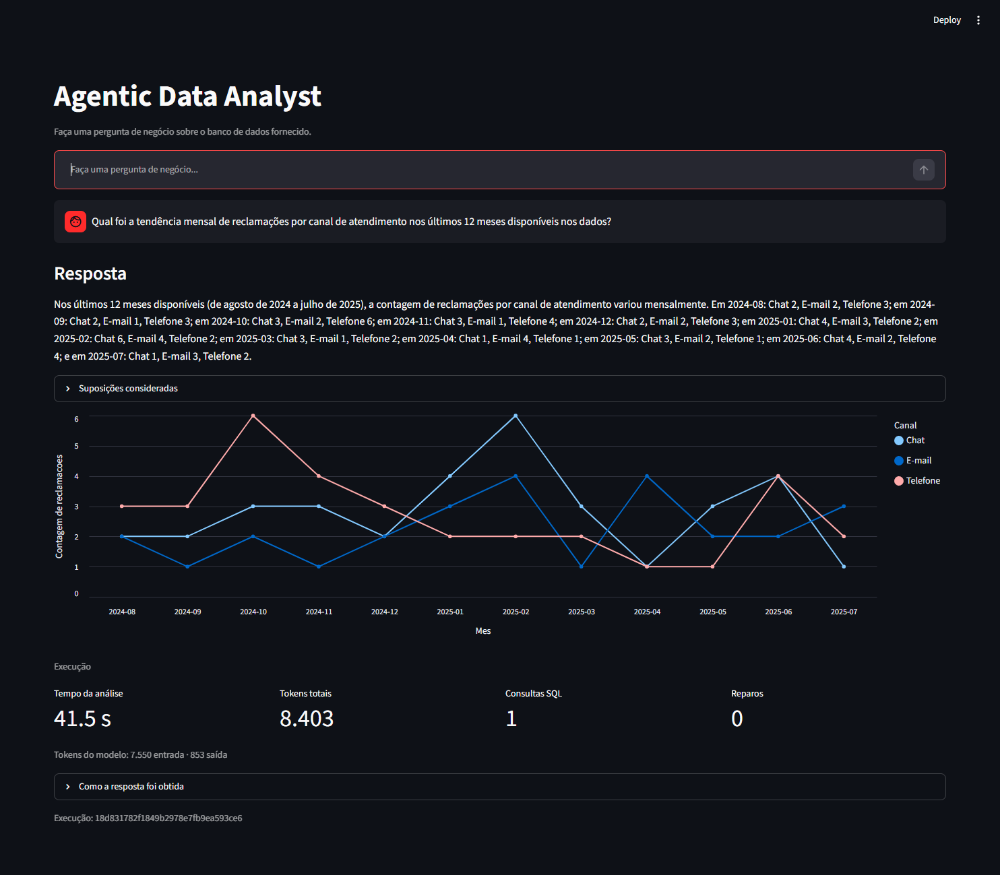

# Agentic Data Analyst

[](https://github.com/mxthsu/agentic-data-analyst/actions/workflows/ci.yml)

Projeto em **Python** para análise de dados em linguagem natural sobre **SQLite**. A aplicação interpreta perguntas, investiga o esquema do banco, gera e valida SQL, avalia os resultados e apresenta respostas acompanhadas de visualizações e rastreabilidade.

**Tecnologias:** Python 3.12 · FastAPI · LangGraph · LangChain · Gemini · SQLite · sqlglot · Streamlit

## Visão geral

A execução não se limita a traduzir uma pergunta para SQL. Um grafo de estados organiza a descoberta dos dados, o planejamento, a execução de consultas e a avaliação das evidências. Conforme o resultado, o fluxo pode realizar outra consulta, corrigir SQL inválido ou solicitar esclarecimento.

- Descoberta dinâmica de tabelas, colunas, relacionamentos, períodos e categorias.
- Consultas SQL geradas em tempo de execução, validadas e executadas em **modo somente leitura**.
- Investigação em múltiplas etapas, com limites para consultas e reparos.
- Respostas fundamentadas nos dados retornados, sem respostas de negócio pré-definidas.
- Visualização por indicador, tabela, barras ou linha, conforme a análise.
- Rastreabilidade de SQL, etapas, suposições, duração e consumo de tokens.

## Demonstração

As imagens abaixo são **capturas da aplicação em execução** com Streamlit, FastAPI, LangGraph, Gemini e a base SQLite de referência. Os valores são provenientes das consultas, não de telas simuladas.

### Compras por estado e canal

**Pergunta:** Quais são os cinco estados com maior número de clientes distintos que compraram via App em maio de 2025?

**Resultado observado:** São Paulo (6), Minas Gerais (3), Santa Catarina (3), Alagoas (2) e Espírito Santo (2).



<details>
<summary><strong>Interações em campanhas de WhatsApp</strong> — 17 clientes distintos em 2024</summary>



</details>

<details>
<summary><strong>Média de compras por categoria</strong> — comparação entre seis categorias</summary>



</details>

<details>
<summary><strong>Reclamações não resolvidas por canal</strong> — Telefone: 19; Chat: 18; E-mail: 14</summary>



</details>

<details>
<summary><strong>Evolução mensal de reclamações</strong> — agosto de 2024 a julho de 2025</summary>



</details>

Os resultados dos cinco cenários podem ser conferidos por [consultas SQL independentes](tests/evals/test_reference_queries.py) e reproduzidos localmente com a base de referência.

## Instalação e execução

### Pré-requisitos

- **Python 3.12 ou superior** e **Git**;
- **Windows / PowerShell** para utilizar os scripts fornecidos;
- chave da [Gemini Developer API](https://aistudio.google.com/apikey);
- banco SQLite compatível. **A base usada nas capturas não é distribuída neste repositório.**

### Início rápido no Windows

```powershell
git clone https://github.com/mxthsu/agentic-data-analyst.git
cd agentic-data-analyst

.\setup.ps1
.\start.ps1
```

O `setup.ps1` prepara o ambiente virtual, instala as dependências e configura o `.env`. O script solicita a chave Gemini e, caso o banco ainda não exista, o caminho do arquivo SQLite, copiado para `data/anexo_desafio_1.db`. O arquivo de dados e as credenciais não são versionados.

O `start.ps1` inicia os serviços em janelas separadas, verifica a disponibilidade da API e do Streamlit e abre a interface.

| Serviço | URL local |
| --- | --- |
| Interface Streamlit | [http://localhost:8501](http://localhost:8501) |
| API FastAPI | [http://localhost:8000](http://localhost:8000) |
| Swagger/OpenAPI | [http://localhost:8000/docs](http://localhost:8000/docs) |

Caso a política do PowerShell bloqueie os scripts, ajuste **somente a sessão atual**:

```powershell
Set-ExecutionPolicy -Scope Process -ExecutionPolicy Bypass
.\setup.ps1
```

### Execução manual

Com a configuração concluída, abra dois terminais na raiz do repositório.

**API:**

```powershell
.\.venv\Scripts\python.exe -m uvicorn data_analyst.api.main:app --app-dir src
```

**Interface:**

```powershell
.\.venv\Scripts\python.exe -m streamlit run ui/streamlit_app.py
```

### Exemplo de chamada à API

O endpoint `POST /ask` recebe uma pergunta e retorna resposta, dados consultados, especificação de visualização, suposições e rastro da execução.

```powershell
$body = @{
    question = "Quantos clientes distintos interagiram com campanhas de WhatsApp em 2024?"
} | ConvertTo-Json

Invoke-RestMethod -Uri "http://localhost:8000/ask" -Method Post -ContentType "application/json" -Body $body
```

O contrato completo está em [`src/data_analyst/api/schemas.py`](src/data_analyst/api/schemas.py).

## Arquitetura

```text
Streamlit
    |
    v
FastAPI (/ask)
    |
    v
LangGraph
    |
    +-- descoberta do esquema
    +-- interpretação e contexto temporal
    +-- planejamento da investigação
    +-- geração de SQL
    +-- validação ----> reparo de SQL
    +-- execução -----> reparo de SQL
    +-- avaliação da evidência
    |       +--> nova consulta
    |       +--> esclarecimento
    |       +--> resposta
    +-- síntese e seleção da visualização
    |
    v
SQLite (somente leitura)
```

O **LangGraph** gerencia estado e transições. O **LangChain Core** fornece abstrações de modelo e saídas estruturadas. O **Gemini** participa da interpretação, planejamento, geração, reparo, avaliação e síntese; segurança SQL, limites de execução, política temporal e escolha da visualização são determinísticos.

| Componente | Responsabilidade |
| --- | --- |
| [`ui/streamlit_app.py`](ui/streamlit_app.py) | Interface, gráficos e rastro operacional |
| [`api/main.py`](src/data_analyst/api/main.py) | API e tratamento de erros |
| [`agent/graph.py`](src/data_analyst/agent/graph.py) | Fluxo e transições do agente |
| [`database/inspector.py`](src/data_analyst/database/inspector.py) | Descoberta do esquema |
| [`safety/sql_guard.py`](src/data_analyst/safety/sql_guard.py) | Validação estrutural do SQL |
| [`database/executor.py`](src/data_analyst/database/executor.py) | Consultas SQLite somente leitura |
| [`visualization/policy.py`](src/data_analyst/visualization/policy.py) | Escolha de visualização |

### Segurança e limites

O executor usa `sqlglot`, SQLite em `mode=ro`, `PRAGMA query_only=ON` e autorizador de operações. SQL reparado também precisa passar pela validação.

Por pergunta, o grafo admite até **4 consultas executadas**, **2 reparos de SQL** e **12 passos investigativos**. Por consulta, o executor aplica limites padrão de **5 segundos** e **500 linhas**. Perguntas ambíguas ou sem suporte suficiente nos dados podem resultar em pedido de esclarecimento ou encerramento controlado.

## Testes e validação

Instale as dependências de desenvolvimento:

```powershell
.\.venv\Scripts\python.exe -m pip install -e ".[dev]"
```

Execute os testes e a análise estática:

```powershell
.\.venv\Scripts\python.exe -m pytest -q
.\.venv\Scripts\python.exe -m ruff check src tests ui
```

| Requisito verificado | Evidência no repositório |
| --- | --- |
| Leitura e descoberta dinâmica do esquema | Testes unitários e de integração do banco |
| Planejamento, múltiplas consultas e avaliação da evidência | Testes do fluxo agentivo |
| Validação de SQL, bloqueio de escrita e reparos | Testes de segurança e executor |
| Tratamento de períodos ambíguos e falhas | Testes de política temporal e roteamento |
| Resposta, visualização e rastro | Testes de API e visualização |
| Resultados dos cinco exemplos | [Avaliações SQL independentes](tests/evals/test_reference_queries.py) |

O [CI](.github/workflows/ci.yml) executa `ruff` e `pytest` em pull requests e pushes na branch `main`. Testes com o modelo real ficam em `tests/e2e` e exigem banco local, credenciais e `RUN_E2E=1`. Eles não integram o CI obrigatório, para evitar consumo da API em cada execução.

Para habilitar os testes E2E no PowerShell:

```powershell
$env:RUN_E2E = "1"
.\.venv\Scripts\python.exe -m pytest -q tests/e2e
Remove-Item Env:RUN_E2E
```

A [especificação técnica](docs/SPEC-001-agentic-data-analyst.md) detalha requisitos, critérios de aceite e decisões de escopo.

## Estrutura do projeto

```text
agentic-data-analyst/
├── src/data_analyst/
│   ├── agent/          # Estado, grafo e nós
│   ├── api/            # FastAPI e contratos
│   ├── database/       # Descoberta e consultas
│   ├── safety/         # Política de segurança SQL
│   └── visualization/  # Política de visualização
├── ui/                 # Interface Streamlit
├── tests/              # Unitários, integração, avaliações e E2E
├── docs/               # Especificação, ADRs e capturas
├── data/               # Banco local não versionado
├── setup.ps1           # Configuração local
└── start.ps1           # Inicialização
```

**Documentação:** [Especificação](docs/SPEC-001-agentic-data-analyst.md) · [Descoberta do banco](docs/DESCOBERTA-BANCO.md) · [Decisões arquiteturais](docs/adr/) · [Estudo de arquitetura complementar](docs/ARQUITETURA-DESAFIO-2.md)

## Limitações e possíveis evoluções

A implementação atual trabalha com **SQLite** em execução local. Não inclui autenticação, autorização por usuário, múltiplos locatários, memória persistente ou infraestrutura distribuída. O uso do Gemini depende de credenciais válidas e da disponibilidade do provedor.

Os resultados das capturas referem-se à base utilizada na demonstração. Outras bases e versões do modelo podem produzir respostas ou tempos diferentes. Entre as extensões possíveis estão suporte a novos bancos, persistência de sessões, avaliações adicionais, tracing externo e implantação gerenciada.
